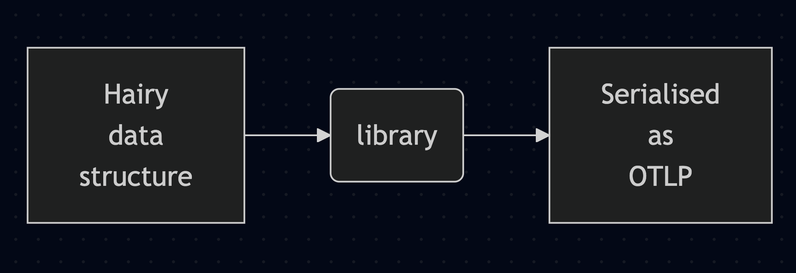

<!-- font_size: 6 -->
<!-- new_lines: 4 -->
## Python fangs to Rusty nails

<!-- new_lines: 1 -->
re-coding a simple lib
===
Dima Tisnek
---

<!-- end_slide -->
<!-- font_size: 6 -->
<!-- new_lines: 1 -->
## otlp-json

<!-- font_size: 4 -->
Pure Python, data to JSON



<!-- font_size: 6 -->
### otlp-proto

<!-- font_size: 4 -->
Rust extension, data to protobuf


<!-- end_slide -->
<!-- font_size: 2 -->
<!-- new_lines: 2 -->

<!-- font_size: 6 -->
## Python
<!-- font_size: 2 -->
```python
  def _ensure_homogeneous(value: Sequence[_LEAF_VALUE]) -> Sequence[_LEAF_VALUE]:
      if len(types := {type(v) for v in value}) > 1:
          raise ValueError(f"Value arrays must be homogeneous, got {types=}")
      return value
```
<!-- new_lines: 2 -->

<!-- font_size: 6 -->
### C-like Rust
<!-- font_size: 2 -->
```rust
#[pyfunction]
#[pyo3(signature = (value))]
fn _ensure_homogeneous(value: &Bound<'_, PyAny>) -> PyResult<()> {
    let mut last: *mut ffi::PyObject = ptr::null_mut();
    for v in value.try_iter()? {
        let class = v?.get_type().as_ptr();
        if !last.is_null() && last != class {
            return Err(PyValueError::new_err(
                "Value arrays must be homogeneous",
            ));
        }
        last = class;
    }
    Ok(())
}
```


<!-- end_slide -->
<!-- font_size: 6 -->
## Python
<!-- font_size: 2 -->

```python
resource_cache: dict[Resource, tuple] = {}
scope_cache: dict[InstrumentationScope, tuple] = {}

def linearise(span: ReadableSpan):
    ...
    # use resource_cache
    # use scope_cache

spans = sorted(spans, key=linearise)
```

<!-- font_size: 6 -->
### Rust
<!-- font_size: 2 -->

```rust
let resource_cache = PyDict::new(py);
let scope_cache = PyDict::new(py);

let key = m.getattr("functools")?.call_method1(
    "partial",
    (m.getattr("_linearise")?, resource_cache, scope_cache),
)?;

let kwargs = [("key", key)].into_py_dict(py)?;

let spans = m.getattr("builtins")?.call_method(
    "sorted", (sdk_spans.as_ref(),), Some(&kwargs),
)?;
```

<!-- end_slide -->

<!-- jump_to_middle -->

Farming potatoes
===

<!-- end_slide -->
